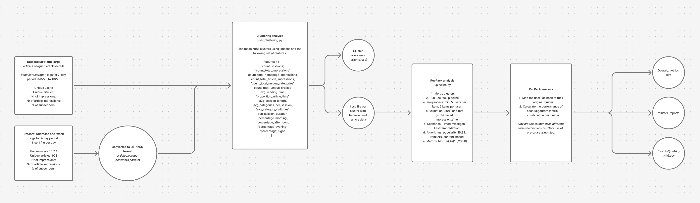

# RICON analysis

## Overview

## Description

This is a monorepo for the analysis for the paper "Not One News Recommender To Fit Them All: How Different News Recommender Strategies Serve Different Engagement-based User Segments"
This repo contains the code for the user clustering and the subsequent cluster analysis using recpack.

We deliberately chose to split the code into two separate parts, to make a clear separation between the clustering itself and the cluster analysis.

## Datasets

The datasets can be downloaded from:

- Ekstra dataset (EB-NeRD): https://recsys.eb.dk/
- Adressa: https://reclab.idi.ntnu.no/dataset/

## How to run

1. Start with the 1-user-clustering folder and follow the instructions in the README there.
2. Then move the resulting clusters to the 2-cluster-analysis folder and follow the instructions in the README there.
